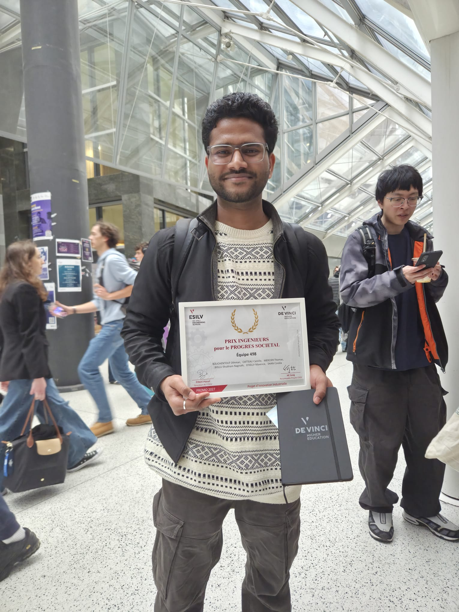

# ALLEGRI — AI-Assisted Reading of Gram Stains & Blood Smears

An AI-assisted diagnostic support system built with a real hospital partner (Centre Hospitalier de Saint-Denis / Delafontaine Hospital) as part of ESILV's Pi² industry-partnership program. It couples a low-cost microscope camera with a YOLOv11 model to detect bacteria (Gram stains) and malaria parasites (blood smears), paired with a web and Android app for hospital staff to review results in real time.

🏆 **This project won a prize at ESILV** — see the [LinkedIn post](https://lnkd.in/p/eHwZRPXM)



## The problem
Bacterial and parasitic infections are among the leading causes of preventable death worldwide, and delayed antibiotic treatment is the single biggest factor. Identifying species from a Gram stain, or diagnosing malaria from a blood smear, normally requires an experienced biologist — who isn't always on-site during night shifts. ALLEGRI was built to give clinical staff real-time, AI-assisted support in exactly those moments.

## What we built
- A digital camera (Bresser MikroCam SF 5.0MP + AmScope 0.5x reduction lens) mounted on a standard microscope, capturing high-resolution slide images
- A YOLOv11 model running **locally on a Raspberry Pi 5** — a deliberate edge-computing choice so patient images never have to leave the hospital, keeping the system GDPR-compliant by design
- A web application and Android app for staff to capture images, view detections with bounding boxes and confidence scores, and validate results from any device

## Results
- **92.9% mAP50** for bacteria detection
- **87.9% mAP50** for malaria detection
- Positively received by the hospital partner as a strong, real-world-tested proof-of-concept

## ⚠️ About the live demo
The hosted site below shows the full web application UI and workflow — but the actual bacteria/malaria detection only runs when the app is connected to the physical rig (Raspberry Pi + camera + microscope), which isn't something that can be hosted online. The demo video shows the complete system detecting bacteria in real use.

- **Live site (UI/workflow):** https://allegriproject.netlify.app/
- **Demo video (full system in action):** https://canva.link/dfi0v96jaxkkash

## My role
Application development, paired with a teammate — built the web/mobile interface that lets hospital staff capture images, view live detection results, and validate them from any hospital device.

## Team
A 6-person ESILV engineering team (Pi² project, team n°498), organized into three specialized pairs: image acquisition/hardware, AI model development, and application development — working directly with Centre Hospitalier de Saint-Denis as the clinical partner.

## Tech stack
- **AI/ML:** YOLOv11, Python
- **Backend:** FastAPI (REST API, JSON)
- **Frontend:** React (web), Android (Material Design / Android SDK)
- **Hardware:** Raspberry Pi 5, Bresser MikroCam SF 5.0MP, AmScope 0.5x reduction lens, 3D-printed PLA camera mount
- **Networking & privacy:** Wi-Fi/TCP-IP local network, GDPR/RGPD privacy-by-design via edge computing

## What's next
From our project closure report, the key next steps identified were: enriching the training dataset with real clinical images (now formally authorized by the hospital's ethics committee), migrating AI inference to the cloud to resolve Raspberry Pi hardware limits, and finalizing a medical-grade hardware casing for clinical use.

## Files in this repo
- Project synopsis (original brief from the hospital partner)
- [ALLEGRI Closure Report](./ALLEGRI_Closure_Report.pdf) — full technical writeup: methodology, risk management, engineering standards, results
- `allegri-hospital-project/` — frontend app source code (see technical documentation below)

---

# Technical Documentation

A lightweight React/Vite **thin client** designed to interface with a Raspberry Pi Edge AI device. The Pi handles all heavy lifting: YOLO microscope image analysis, camera streaming, and SQLite database storage. This frontend is purely a display and control surface.

## Architecture Notes

**Kiosk Mode — No Authentication.** This app runs in Kiosk Mode for its hospital deployment context. Login and user-profile management were intentionally removed — the app boots directly into the dashboard as a hardcoded device user, since it's meant to run on a single fixed workstation next to the microscope, not a shared login system.

**No Local Webcam.** The app exclusively uses the Raspberry Pi's camera via an MJPEG stream, not the browser's own webcam — keeping image capture consistent with the physical microscope rig regardless of what device is displaying the dashboard.

**Doctor Override.** Detection results from the YOLO model can be reviewed and corrected by clinical staff through a dedicated override modal — a deliberate design choice to keep a human in the loop rather than treating the AI's output as final.

**Privacy by design.** `localStorage` is used for exactly one thing: remembering the Pi's IP address between page refreshes. All patient-related data is fetched live from the Pi's own SQLite database via the backend API — nothing medical is ever stored in the browser.

### Backend Endpoints

| Server | Default Base URL | Purpose |
|---|---|---|
| Pi API | `http://{PI_IP}:8000` | YOLO analysis, history, health check |
| Pi Camera | `http://{PI_IP}:5000` | MJPEG live stream, frame capture |

## Getting Started

**Prerequisites:** Node.js 18+ and npm.

```bash
cd allegri-hospital-project
npm install
npm run dev
```

Vite will print a local URL (typically `http://localhost:5173`).

### Connecting to the Raspberry Pi
On first launch, open **Network Settings** in the dashboard and enter either:
- The Pi's local IP address (e.g. `192.168.137.47`) — when on the same network, or
- A Serveo/Pinggy tunnel URL — for remote access across different networks

The header's status indicator turns green once the Pi is reachable.

## Project Structure

```
allegri-hospital-project/
├── App.tsx                     # Root component, view routing, state
├── index.tsx                   # ReactDOM entry point
├── types.ts                    # Shared TypeScript interfaces
├── components/
│   ├── CameraView.tsx          # Pi camera stream + batch capture workflow
│   ├── DoctorOverrideModal.tsx # Edit/correct YOLO detection results
│   ├── Header.tsx              # Logo, health status, Pi connectivity indicator
│   ├── HistoryView.tsx         # View session-local analysis results
│   ├── NetworkSettings.tsx     # Pi IP / tunnel URL configurator
│   └── PatientHistoryView.tsx  # Fetch & browse history from Pi database
├── services/
│   ├── piConfig.ts             # Builds all API endpoint URLs from stored IP
│   └── piService.ts            # All HTTP calls to the Pi backend
└── utils/
    └── sampleNaming.ts         # Auto-generates sample label names
```

## Tech Stack

| Tool | Version |
|---|---|
| React | 19 |
| Vite | 6 |
| TypeScript | 5 |
| lucide-react | 0.556 (icons) |
| Capacitor | 8 (Android packaging) |
